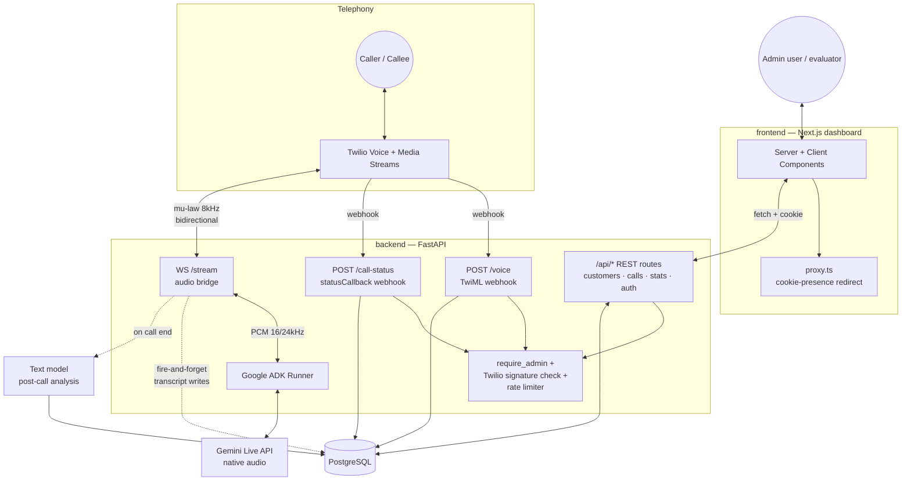
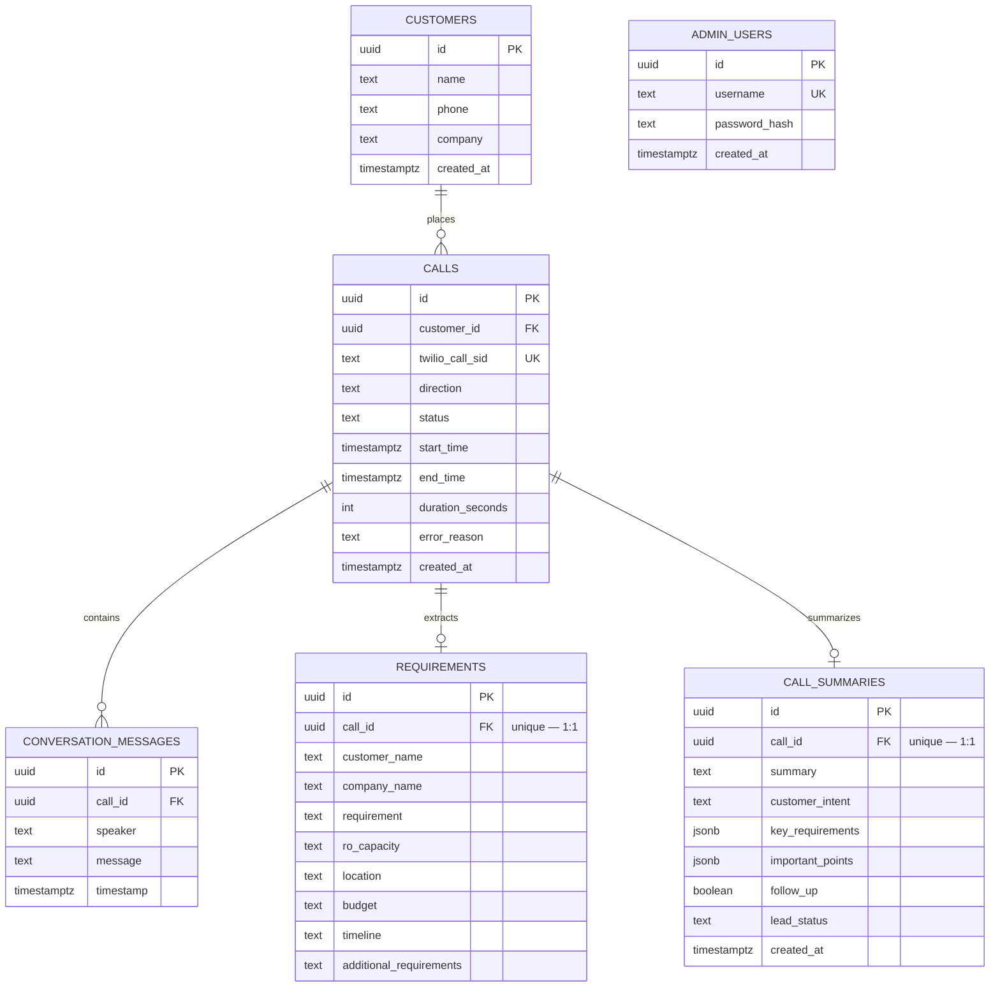

# Architecture

This document describes the system as actually implemented, not an aspirational target. See
[database/README.md](database/README.md) for schema details.

## System overview



## What we did **not** rebuild

The Twilio ↔ FastAPI ↔ Google ADK ↔ Gemini Live audio bridge (`backend/audiocall/main.py`) is the
original upstream [`Iamsdt/audiocall`](https://github.com/Iamsdt/audiocall) core, kept as-is:
μ-law/PCM conversion, barge-in/interruption handling, bidirectional streaming over a single
WebSocket. Everything else in this document is new.

## Two data paths through the same call

**Live path (real-time, must never block on the database):** Twilio streams caller audio over
`/stream`; the server resamples it and pushes it into the ADK `LiveRequestQueue`; ADK/Gemini Live
streams back synthesized speech, resampled back to μ-law for Twilio. Every DB write on this path
(transcript turns, stream-started timestamp) is scheduled with `asyncio.create_task` and never
awaited inline — a slow or failing DB write must not introduce audio latency or drop the call.

**Post-call path (asynchronous, can take its time):** when a call transitions into a terminal
status (`completed`, `failed`, `no_answer`, `disconnected` — from either `/call-status` or the
stream's own cleanup in its `finally` block), `calls_service._maybe_trigger_analysis` fires
`post_call_processing` exactly once via `asyncio.create_task`. That function builds the full
transcript text from `conversation_messages` and sends it to a **second, non-live** text model —
Gemini (`SUMMARY_MODEL`) by default, or NVIDIA NIM if `SUMMARY_PROVIDER=nvidia` — constrained to
the `CallAnalysis` JSON shape, and upserts the result into `requirements` and `call_summaries`. A
failed extraction retries once, then gives up and leaves the call without a summary rather than
blocking anything else.

## Request paths and their guards

| Path | Guard | Why |
|---|---|---|
| `/voice`, `/call-status` | Twilio `X-Twilio-Signature` HMAC validation (`verify_twilio_signature`) | Only Twilio, holding `TWILIO_AUTH_TOKEN`, can produce a valid signature — stops forged webhooks from creating fake calls or corrupting call status |
| `/api/*` (except `/api/auth/login`) | `require_admin` FastAPI dependency — signed session cookie | Keeps the dashboard's data endpoints from being wide open to the internet |
| `POST /api/calls` | Same session guard + in-memory sliding-window rate limit (5/60s per admin username) | Outbound calling is billable; caps runaway or scripted abuse from a compromised session |
| `/stream` (WebSocket) | None beyond `call_id` correlation | Twilio's Media Streams protocol has no signature scheme for WS connections in this integration; the URL itself is only ever handed to Twilio via the signed `/voice` TwiML response |
| Dashboard pages (`frontend`) | `proxy.ts` cookie-presence check (fast, not cryptographic) **plus** every Server Component's data fetch getting a real 401 from the backend and redirecting via `redirectIfUnauthenticated` | Two-layer by design: the proxy can't verify the signature without shipping `SESSION_SECRET` to the edge/client, so the backend dependency is the actual security boundary |

## Database

5 domain tables plus `admin_users`, `alembic_version`. Full column list in
[database/schema.sql](database/schema.sql); migrations are the source of truth, in
`backend/alembic/versions/`.



`ADMIN_USERS` has no foreign-key relationship to the domain tables — it exists purely to gate the
dashboard: a single admin user, real bcrypt-hashed passwords, no self-registration.

## Directory layout

```text
backend/audiocall/
├── main.py            # FastAPI app: /call /voice /call-status /stream /health, security headers
├── agent.py            # Google ADK agent definition (RO sales qualification persona)
├── core/               # config.py (env + Twilio client), security.py (auth+Twilio sig), rate_limit.py
├── db/                  # SQLAlchemy models + async session
├── services/            # calls, customers, transcript, summary (AI extraction), stats, auth
└── api/                 # /api/* route modules + Pydantic request/response schemas
frontend/src/
├── app/                 # routes only: (dashboard)/{page,customers,calls}, login
├── components/{ui,sections,layout}
├── lib/                 # apiClient (browser), serverApiClient (Server Components + cookie), auth
└── proxy.ts             # Next.js 16's replacement for middleware.ts
```

## Known limitations

- **Single admin user, no roles.** `admin_users` supports multiple rows, but there's no
  self-registration or role model — an operator creates users out-of-band with
  `scripts/create_admin.py`. Fine for one operator, not a multi-tenant system.
- **No horizontal scaling of the rate limiter.** `core/rate_limit.py` is an in-memory
  per-process sliding window. Running more than one backend instance would let each instance's
  limiter track a disjoint 5-per-60s budget. Fine for a single-process deployment; would need a
  shared store (Redis) to scale out.
- **No session table / revocation.** Session tokens are stateless signed `username:expiry` pairs.
  There is no way to force-invalidate a single issued session before its 12-hour expiry (e.g. on
  a suspected credential leak) short of rotating `SESSION_SECRET`, which invalidates every session
  at once.
- **`POST /call` is intentionally unauthenticated.** Kept from the upstream project for manual
  curl testing without a browser session; documented in the README as "don't expose publicly."
  The dashboard only ever calls the guarded `/api/calls`.
- **No automated test suite.** Verification has been manual — scripted scenarios against a
  throwaway Postgres database for persistence/retry logic, plus real end-to-end Twilio + Gemini
  Live test calls for the audio path and post-call extraction. There's no `pytest` suite or CI gate
  re-running these checks on future changes.
- **Twilio `/stream` has no per-connection auth.** Its only correlation to a real call is the
  `call_id`, handed to the client via a `<Parameter>` inside the `<Stream>` TwiML that Twilio only
  ever requests through a signature-validated `/voice` call — but the WebSocket endpoint itself
  doesn't independently verify the caller is really Twilio.
