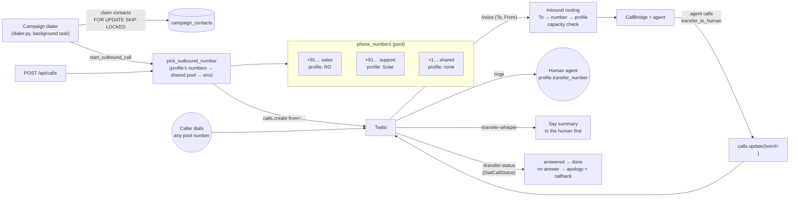
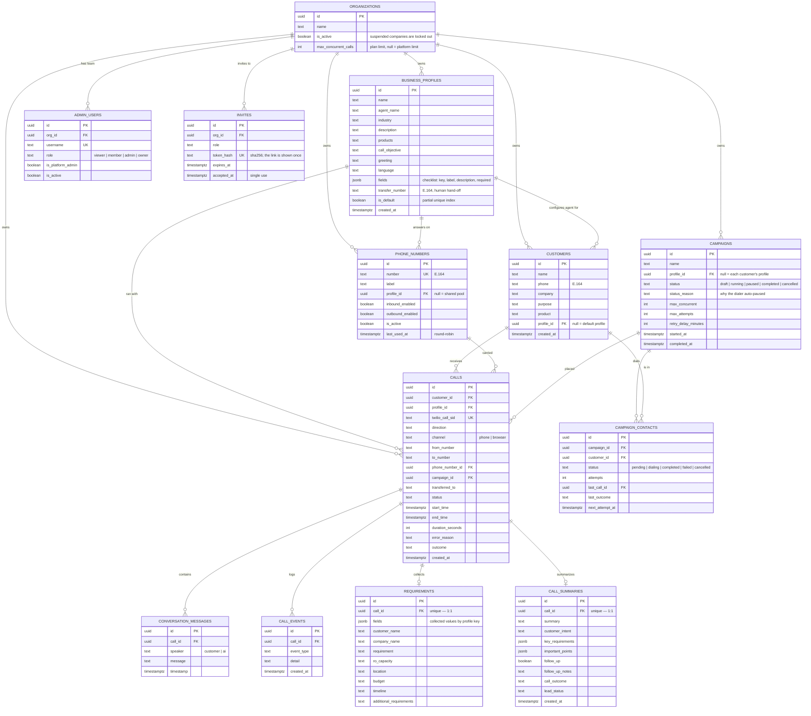

# Architecture

This document describes the system as it is actually implemented, not an aspirational target. See
[database/README.md](database/README.md) for schema details.

## System overview

```mermaid
flowchart TB
    subgraph Channels
        Caller((Customer phone))
        Mic((Customer in browser))
        Twilio[Twilio Voice + Media Streams]
    end

    subgraph Backend["backend — FastAPI"]
        Voice["POST /voice\nTwiML webhook"]
        Status["POST /call-status\nstatusCallback webhook"]
        Stream["WS /stream\nTwilioTransport"]
        BStream["WS /browser-stream\nBrowserTransport"]
        Bridge["CallBridge\n(voice/bridge.py)"]
        Agent["ADK agent + tools\n(agent.py, conversation.py)"]
        API["/api/* REST routes\nprofiles · customers · calls · stats · auth"]
        Post["Post-call analysis\n(summary_service.py)"]
        Sec[require_user + roles\n(scoped to the user's company) +\nTwilio signature check +\nstream tokens + rate limiter]
    end

    Gemini[Gemini Live API\nnative audio: STT + LLM + TTS]
    SummaryModel[Text model\npost-call analysis]
    DB[(PostgreSQL)]

    subgraph Frontend["frontend — Next.js dashboard"]
        UI[Server + Client Components]
        BC[BrowserCall\nmic AudioWorklet + playback]
    end

    Admin((Admin))

    Caller <--> Twilio
    Twilio -- webhook --> Voice
    Twilio -- webhook --> Status
    Twilio <-- "μ-law 8 kHz" --> Stream
    Mic <--> BC
    BC <-- "PCM 16k up / 24k down" --> BStream
    Stream --> Bridge
    BStream --> Bridge
    Bridge <-- "PCM 16/24 kHz" --> Agent
    Agent <--> Gemini
    Agent -. "save_customer_info\n(live)" .-> DB
    Bridge -. "turns · events · status\n(fire-and-forget)" .-> DB
    Bridge -- "stream ended" --> Post
    Post <--> SummaryModel
    Post --> DB
    Voice --> Sec
    Status --> Sec
    BStream --> Sec
    Status --> DB

    Admin <--> UI
    UI <-- "fetch + cookie" --> API
    API --> Sec
    API <--> DB
    API -- "calls.create" --> Twilio
```

## The conversation engine

`backend/audiocall/voice/` splits the live call into two layers:

* **Transports** (`transports.py`) adapt a channel's audio to and from PCM-16, the format
  Gemini Live speaks:
  * `TwilioTransport`: Twilio Media Stream JSON frames, μ-law 8 kHz ⇄ PCM 16 kHz in / 24 kHz out
    (`audioop-lts`). This conversion is the upstream
    [`Iamsdt/audiocall`](https://github.com/Iamsdt/audiocall) code, moved here unchanged.
  * `BrowserTransport`: binary PCM frames from the dashboard's microphone worklet. No conversion
    needed.

  Both support **marks**: a named marker queued after the agent's audio, which the far end
  echoes back once playback reaches it.
* **`CallBridge`** (`bridge.py`) is channel-independent:
  1. Loads the call's customer and business profile, and starts an ADK Live session whose
     **state** carries them, along with any fields already known.
  2. Tells the agent to open the conversation. On an outbound call the agent speaks first.
  3. Streams audio both ways with **barge-in**: when Gemini flags `interrupted`, the transport
     drops audio that's buffered but not yet played.
  4. Saves every finished transcription turn, and pushes live transcript and collected-field
     events to the browser channel.
  5. A watchdog handles **silence** (prompt, then a polite timeout), **max duration** and
     **unrecognised speech** (speech energy without transcription → ask the customer to repeat).
  6. When the agent calls **`end_call`**, it waits for the next `turn_complete`, sends a mark,
     and hangs up once the mark is echoed back, i.e. after the goodbye was actually heard. A
     12-second fallback timer covers lost marks.
  7. On **AI failure**, the customer hears an apology instead of dead air (Twilio: TwiML
     `<Say>` + `<Hangup>`; browser: error message).
  8. Teardown: flush pending writes, then save status, duration, error reason, the agent's
     verdict and the outcome, all **before** closing the line. This step is shielded, because a
     server may cancel the handler once the socket closes. Post-call analysis is then scheduled.

## The agent (agentic design)

`agent.py` defines one ADK `Agent` whose instructions are an `InstructionProvider`, rendered per
call from session state (`profile`, `customer`). That's what makes the agent work for any business.
It has three tools:

| Tool | Effect |
|---|---|
| `save_customer_info(field, value)` | Resolves `field` to a profile key (accepts the key or the label), writes `state["collected"]` and `requirements.fields` in Postgres, records a `field_collected` event, and returns the progress snapshot from `conversation.progress()`: `collected`, `still_missing`, `next_field_to_ask`, `all_required_collected` |
| `get_call_progress()` | The same snapshot, without writing |
| `end_call(lead_status, follow_up_required, reason)` | Stores the agent's verdict. The bridge sees the function call and runs the hang-up sequence |

`conversation.py` holds the pure checklist logic (required fields first, in profile order;
blank values count as missing). Because the *next question* is computed in code and handed back
on every tool call, the agent doesn't have to remember what it already asked, and it never
re-asks for a collected field.

## Two data paths through the same call

**Live path (real time, never blocks on the database).** Transcript turns, events and the
stream-started time are written with `asyncio.create_task` and never awaited inline, so a slow
or failing DB write can't add audio latency or drop the call. The agent's tool calls *are*
awaited, but they're single-row upserts that run while the model is generating anyway.

**Post-call path (asynchronous, can take its time).** `calls_service.mark_stream_ended` is the
one moment the transcript is known to be complete (the bridge flushes pending writes before
calling it). It schedules `summary_service.post_call_processing` once per call. Twilio's
`completed` callback no longer triggers analysis, because it can arrive while the last turns are
still being written. Analysis:

1. builds the transcript text from `conversation_messages`;
2. sends it to a **separate, non-live** text model (Gemini `SUMMARY_MODEL`, or NVIDIA NIM). The
   extraction prompt is generated from the call's business profile, and the output is
   constrained to the `CallAnalysis` JSON shape;
3. merges the result into `requirements` (a null from extraction never erases a value the agent
   saved live) and `call_summaries`, then sets `calls.outcome`.

A failed extraction is retried once. After that it's recorded as an `analysis_failed` event, and
the agent's own `end_call` verdict stays as the lead status and follow-up flag.

## Telephony: numbers, inbound calls, campaigns and human transfer

The phone channel goes beyond one number and one manual call. There are four parts, and all of
them run on the same `CallBridge` and agent.



### 1. Several numbers (`phone_numbers`)

A number is a Twilio number the account owns, registered in the dashboard. It has a `label`,
an optional `profile_id` (the business it belongs to), `inbound_enabled`, `outbound_enabled`,
`is_active` and `last_used_at`.

* **Outbound caller ID** (`numbers_service.pick_outbound_number(profile_id)`):
  1. the active, outbound-enabled numbers assigned to the call's profile;
  2. else the shared pool (active, outbound-enabled, no profile);
  3. else `TWILIO_PHONE_NUMBER` from the environment, so a single-number setup keeps working
     with no rows at all.

  Within a tier, the **least recently used** number wins (`last_used_at NULLS FIRST`). It's
  claimed with `SELECT … FOR UPDATE SKIP LOCKED`, so parallel dials spread across the pool.
* **Inbound routing** uses Twilio's `To` field. The profile of the number that was dialled
  decides which business answers.
* **Twilio setup from the dashboard:** `POST /api/numbers/{id}/sync-twilio` sets the number's
  *A call comes in* webhook (`/voice`) and status callback (`/call-status`) through the Twilio
  REST API. Nobody has to edit the console by hand.
* Each call records `from_number`, `to_number` and `phone_number_id`.

### 2. Inbound calls

`POST /voice` with no `call_id` is an inbound call:

1. Look up `To` in `phone_numbers`. If the number is registered but inactive or has inbound
   switched off, answer with a short `<Say>` and `<Hangup>`. An unregistered number is still
   answered with the default profile (backwards compatible).
2. Find or create the customer by `From`. Profile precedence: the dialled number's profile,
   then the customer's profile, then the default.
3. **Capacity check:** if `MAX_CONCURRENT_CALLS` phone calls are already active, the caller is
   sent straight to the profile's `transfer_number`, or hears a "lines are busy" message. Either
   way the call is recorded with `error_reason=capacity`.
4. Otherwise return `<Connect><Stream>` as usual. The bridge puts `direction=inbound` in the
   session state. The agent's instructions and opening prompt then switch from "I'm calling
   about…" to "Thanks for calling, how can I help?".

### 3. Many calls at once: campaigns

A **campaign** is a list of customers (`campaign_contacts`) plus dialing rules:
`max_concurrent`, `max_attempts`, `retry_delay_minutes`, and an optional profile override.
States: `draft → running ⇄ paused → completed`, or `cancelled` at any point.

`audiocall/dialer.py` runs as a background task in the FastAPI lifespan (`DIALER_ENABLED`).
Every `DIALER_INTERVAL_SECONDS` it does three things:

1. **Reconciles.** Each `dialing` contact whose last call is terminal becomes `completed`, or
   goes back to `pending` with `next_attempt_at = now + retry_delay`. The retry happens when the
   call was `no_answer` or `failed` and attempts remain (`campaigns_service.next_contact_state`,
   a pure function). A call stuck non-terminal past the stale window counts as failed.
2. **Dials.** For each running campaign:
   `slots = min(max_concurrent − dialing, MAX_CONCURRENT_CALLS − active phone calls)`. It claims
   that many due contacts with `FOR UPDATE SKIP LOCKED`, so two server processes never dial the
   same contact. It then calls `start_outbound_call(customer, profile_override, campaign_id)`,
   with dials spaced `1 / DIAL_CALLS_PER_SECOND` apart to stay under Twilio's CPS limit.
3. **Completes** running campaigns that have no `pending` or `dialing` contacts left.

A failure every call would hit (Twilio not configured or credentials rejected, an unreachable
`SERVER_HOST`, no caller number, Twilio unreachable) is flagged `config_error`. The dialer then
**pauses the campaign** with a `status_reason` and gives back the claimed contacts' attempts,
instead of spending every customer's retries on a setup problem. Resuming clears the reason.

Pausing stops new dials but lets live calls finish. Cancelling also marks the pending contacts
`cancelled`. Manual `POST /api/calls` respects the same global `MAX_CONCURRENT_CALLS` and returns
429 when every line is busy.

Running calls in parallel needs no extra machinery: every Twilio media stream is its own
WebSocket handled by its own `CallBridge` task and its own Gemini Live session. The real limits
are Twilio CPS, Gemini Live's concurrent-session quota and `MAX_CONCURRENT_CALLS`.

### 4. Transfer to a real person

A profile can have a `transfer_number` (E.164). On a **phone** call with a transfer number, the
agent gets a fourth tool:

| Tool | Effect |
|---|---|
| `transfer_to_human(reason, summary)` | Records a `transfer_requested` event (with the summary for the human) and tells the agent to say one short "connecting you now" line. On browser calls, or when the profile has no transfer number, it returns `unavailable` and the agent offers a callback instead |

The bridge treats it like `end_call`. It waits for the agent's line to finish playing (the same
mark mechanism), then `TwilioTransport.transfer()` **redirects the live call** with new TwiML
*before* it closes the stream socket. The order matters: closing the socket first would make
Twilio run out of TwiML and hang up.

```xml
<Response>
  <Dial callerId="{business number}" timeout="25"
        action="/transfer-status?call_id=…" method="POST">
    <Number url="/transfer-whisper?call_id=…">{transfer_number}</Number>
  </Dial>
</Response>
```

* **Whisper:** `/transfer-whisper` is played only to the human, before the two sides are
  connected: "Transferred call from Rahul Kumar. {agent's summary}". That makes it a warm
  handoff without a conference bridge.
* **Fallback:** `/transfer-status` gets `DialCallStatus`. `completed` means the human
  conversation happened, so the call hangs up. Anything else (`no-answer`, `busy`, `failed`)
  plays an apology, records `transfer_failed` and sets the outcome to `callback`.
* **Caller ID:** the business number, meaning `from_number` on outbound calls and `to_number`
  on inbound ones. Twilio only allows caller IDs the account owns or has verified.
* **Record keeping:** `calls.transferred_to` is set, the outcome is `transferred`, and the
  status stays `in_progress` until Twilio's final `completed` callback. Post-call analysis still
  writes the summary, but it never overwrites the `transferred` or `callback` outcome. The AI
  part of the transcript is kept. The human part isn't recorded.

## Multiple companies

One installation serves several businesses. An **organization** owns everything a business
works with: business profiles, customers, calls (and through them transcripts, events,
requirements and summaries), phone numbers, campaigns, users, invites, its own Twilio account and
its setup progress.

* **Scoping:** every dashboard route depends on `require_user`. It resolves the session cookie to
  a `UserContext` (user, `org_id`, role) with one query per request and passes `user.org_id` into
  the service. Services filter every query by it. A row from another company is simply "not
  found" (404), and ids from another company can't be used in writes either (422).
  `tests/test_tenancy.py` tries every route against another company's rows.
* **Roles** (`require_role`), from lowest to highest:

  | Role | Can |
  |---|---|
  | `viewer` | See customers, calls, campaigns, results |
  | `member` | Also add and edit customers, place calls, run campaigns |
  | `admin` | Also manage business profiles, numbers, the company's settings and the team |
  | `owner` | Everything, including other admins and owners; renames the company |

  A company always keeps at least one active owner. Nobody can change their own role or remove
  themselves.
* **Platform admin** (`is_platform_admin`): the operator of the installation, the one who runs
  `install.sh`. They create companies (each with a one-time owner link), suspend them, set
  per-company call limits, and own the platform settings.
* **Invites:** single-use links that expire after 7 days. Only a SHA-256 of the token is stored,
  and accepting one locks the row, so a link can't be used twice. Joining creates the account
  in that company with that role.
* **Deactivation is immediate.** Disabling a user or suspending a company makes their next
  request 401, because `require_user` re-reads them every time. The dashboard then clears the
  cookie through `/session-expired`, so there's no redirect loop between `/` and `/login`.
* **Telephony per company:** a company may save its own Twilio account
  (`settings_service.twilio_for(org_id)`). Without one it uses the platform's. Outbound calls,
  hang-ups, transfers and number syncing use the owning company's client. **Webhook signatures
  are checked with the owning company's auth token:** the company is found from the call
  (outbound and transfers, `/call-status`) or from the dialled number (inbound). Calls to a
  number nobody registered go to the platform admin's company. A number belongs to exactly one
  company platform-wide.
* **Capacity:** `calls_service.free_lines(org_id)` returns the lower of the platform's free
  lines (`MAX_CONCURRENT_CALLS`) and the company's own `max_concurrent_calls`. It's used by
  manual calls, the dialer and inbound routing.
* **Upgrading** from a single-company install: migration `f4a2d9c7e1b5` moves all existing data
  into a "Default organization". Existing admins become its owners and platform admins, so
  nothing changes for them.

## Installation and settings

* **Docker:** `install.sh` writes `.env` (random `SESSION_SECRET` and database password) and
  runs `docker-compose.yml`: Postgres, the backend (its entrypoint runs `alembic upgrade head`,
  then optionally creates the admin from `ADMIN_USERNAME` and `ADMIN_PASSWORD`), and the
  dashboard (a Next.js standalone build). The `https` profile adds Caddy, which handles
  Let's Encrypt and serves both on one domain, sending backend paths to FastAPI. Server-side
  rendering reaches the API at `API_INTERNAL_URL=http://backend:8000`. The browser uses the
  public URL baked in at build time.
* **First admin:** while `admin_users` is empty, the server logs
  `/setup?token=…`. The token is an HMAC of `SESSION_SECRET` (or `SETUP_TOKEN`), so every process
  agrees on it and nothing is stored. `POST /api/setup/admin` takes a table lock so only one
  first admin can be created, and stops working once one exists.
* **Settings from the dashboard** (`app_settings`, `services/settings_service.py`): the Twilio
  SID, token and caller number, the Gemini key and the public URL. Saved values override the
  environment, and clearing one falls back to it. Secrets are Fernet-encrypted with a key
  derived from `SETTINGS_ENCRYPTION_KEY` or `SESSION_SECRET`. A secret that can't be decrypted,
  for example after the key changed, is ignored and logged, never fatal. Applying settings
  updates `core.config` in place, rebuilds the Twilio client and drops the cached Gemini
  clients, so new calls use the new key. Every process reloads every 30 s. Code reads these as
  `config.NAME` at call time for that reason.

## Outcome vs. status

`status` is the telephony lifecycle (`queued, ringing, in_progress, completed, failed, no_answer,
disconnected`). `outcome` is what the call achieved (`qualified, not_interested, callback,
transferred, incomplete, no_answer, no_conversation, failed`). It's set from the status when the call becomes
terminal, and refined by the agent's verdict and then the AI analysis (`services/outcome.py`).

## Request paths and their guards

| Path | Guard | Why |
|---|---|---|
| `/voice`, `/call-status`, `/transfer-status`, `/transfer-whisper` | Twilio `X-Twilio-Signature` HMAC validation (`verify_twilio_signature`) with the auth token of the Twilio account of the company the call belongs to. On failure the backend logs the URL it validated against | Only Twilio, which holds that auth token, can produce a valid signature. This stops forged webhooks from creating fake calls or corrupting call status |
| `/api/*` (except login, `/api/setup/status`, `/api/setup/admin`, `/api/join/*`) | `require_user`: signed session cookie resolved to an active user in an active company; `require_role(...)` / `require_platform_admin` on top. Every query is filtered by the user's company | Keeps each company's data private to it, and limits what each role can change |
| `/api/setup/admin` | One-time setup token (HMAC of `SESSION_SECRET`) printed in the server log; works only while no user exists, under a table lock | Lets the installer create the first account without a shell |
| `/api/join/{token}` | Single-use, expiring invite token (only its hash is stored) | Adds a person to exactly one company with exactly one role |
| `POST /api/calls`, `POST /api/calls/browser` | Same session guard (member and up) + in-memory sliding-window rate limit (5 per 60 s per username). Phone calls are also capped by `free_lines` (platform and company limits) | Outbound calling is billable, and AI sessions cost quota |
| Campaign dialer | Runs inside the server, no HTTP surface. Started and stopped through the session-guarded `/api/campaigns/*` routes | Bulk dialing is the most expensive action, so it only runs from campaigns an admin started |
| `/browser-stream` (WebSocket) | HMAC token from `POST /api/calls/browser`, bound to one `call_id`, valid for 2 minutes. Only accepted while that call is still `queued` on the `browser` channel | Cookies can't be relied on cross-site for WebSockets; the token can't be reused or pointed at another call |
| `/stream` (WebSocket) | None beyond `call_id` correlation | Twilio's Media Streams protocol has no signature scheme for WebSocket connections. The URL is only ever handed to Twilio via the signed `/voice` TwiML response |
| Dashboard pages | `proxy.ts` cookie-presence check, **plus** every Server Component's data fetch getting a real 401 from the backend and redirecting | The backend dependency is the actual security boundary |

## Database

Eleven domain tables plus `app_settings`, `admin_users`, `invites` and `alembic_version`. Every
domain table except the call children and `campaign_contacts` carries `org_id`; those inherit it
from their call or campaign. Full column list in
[database/schema.sql](database/schema.sql). Migrations in `backend/alembic/versions/` are the
source of truth.



`requirements.fields` (JSONB) is the generic store that works for any profile. The fixed
columns are kept and filled whenever a key matches (the default RO profile), so existing
reporting SQL keeps working. Each call stores the `profile_id` it ran with, so a call is always
rendered with the labels of the profile it actually used.

## Directory layout

```text
backend/audiocall/
├── main.py              # FastAPI app: webhooks, /stream, /browser-stream, /health, security headers
├── agent.py             # ADK agent: per-call instructions from the business profile + tools
├── conversation.py      # pure checklist logic (next field, progress) used by the tools
├── profiles.py          # default RO profile + field-key helpers
├── phone.py             # E.164 normalisation / validation
├── dialer.py            # campaign dialer background task (reconcile → dial → complete)
├── voice/               # transports.py (Twilio, browser) + bridge.py (conversation engine)
├── core/                # config, security (sessions, Twilio signature, stream tokens), rate limit
├── db/                  # SQLAlchemy models + async session
├── services/            # calls, customers, profiles, requirements, transcript, events,
│                        #   summary (post-call AI), outcome, stats, auth,
│                        #   numbers (pool + Twilio sync), campaigns, telephony (TwiML)
└── api/                 # /api/* routers + Pydantic schemas (incl. numbers, campaigns)
backend/tests/           # pytest: conversation, validation, transports, simulated calls
frontend/src/
├── app/(dashboard)/     # overview, customers (+ /[id]/call browser call), calls, profiles,
│                        #   numbers, campaigns
├── components/sections/ # BrowserCall, ProfileForm, CustomerForm, CallEventsTimeline, …
├── lib/                 # apiClient, serverApiClient, auth, formatters
└── proxy.ts             # Next.js 16's replacement for middleware.ts
frontend/public/audio/pcm-capture-worklet.js  # mic → PCM-16 16 kHz
```

## Known limitations

- **One company per user.** A person who works for two companies needs two accounts. There's
  no self-service sign-up either: companies are added by the platform admin, and people join by
  invite.
- **No per-company data export or deletion yet.** Removing a company means deleting its
  organization row, which cascades, after its calls' child rows are deleted (see
  `tests/dbhelpers.py`).
- **In-process state.** The rate limiter, ADK `InMemorySessionService` and the
  analysis-scheduled guard live in one process. (The campaign dialer is already safe to run
  in several processes: it claims contacts with `SKIP LOCKED`.) Scaling out needs sticky WebSocket routing and a
  shared store (Redis) for the rate limiter.
- **Sessions are revoked per user, not per device.** Session tokens are signed
  `username:expiry` pairs. Disabling the user ends all of their sessions at once. Ending only one
  device's session would need a session table.
- **Twilio `/stream` has no per-connection auth** (see the guards table).
- **No Live-session resumption.** If Gemini drops a session mid-call, the customer hears an
  apology and the call ends as `ai_error`, rather than reconnecting transparently.
- **The speech-recognition-failure heuristic is energy-based.** Persistent loud background noise
  with no speech could trigger a "please repeat" prompt, at most once every 20 seconds.
- **Transfer is a cold-plus-whisper handoff.** The human hears the agent's summary, then is
  connected. The human part of the conversation isn't recorded or transcribed, and there's no
  hold music or queue. Several agents or a ring group would need a TwiML `<Dial>` with several
  `<Number>`s, or a Twilio TaskRouter integration.
- **Transfers don't work on browser calls.** No phone line exists to redirect, so the tool
  answers `unavailable` and the agent offers a callback.
- **Tests fake the AI and the telephony.** The pytest suite covers the conversation engine,
  tools, validation and transports with Gemini and Twilio faked. Real audio quality and model
  behaviour still need a manual end-to-end call.
