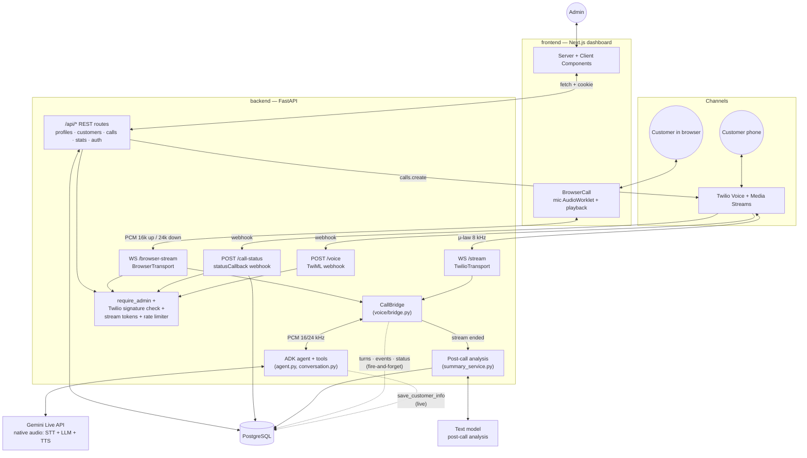
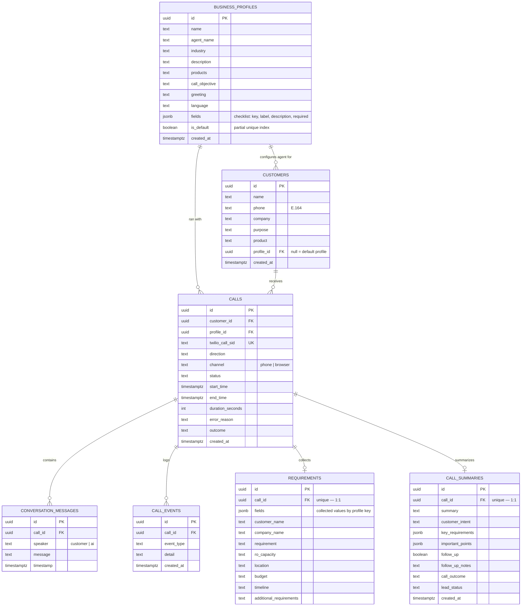

# Architecture

This document describes the system as it is actually implemented, not an aspirational target. See
[database/README.md](database/README.md) for schema details.

## System overview



## The conversation engine

`backend/audiocall/voice/` splits the live call into two layers:

* **Transports** (`transports.py`) adapt a channel's audio to and from PCM-16, the format
  Gemini Live speaks:
  * `TwilioTransport`: Twilio Media Stream JSON frames, μ-law 8 kHz ⇄ PCM 16 kHz in / 24 kHz out
    (`audioop-lts`). This conversion is the upstream
    [`Iamsdt/audiocall`](https://github.com/Iamsdt/audiocall) code, moved here unchanged.
  * `BrowserTransport`: binary PCM frames from the dashboard's microphone worklet. No conversion
    needed.

  Both support **marks**: a named marker queued after the agent's audio, which the far end
  echoes back once playback reaches it.
* **`CallBridge`** (`bridge.py`) is channel-independent:
  1. Loads the call's customer and business profile, and starts an ADK Live session whose
     **state** carries them, along with any fields already known.
  2. Tells the agent to open the conversation. On an outbound call the agent speaks first.
  3. Streams audio both ways with **barge-in**: when Gemini flags `interrupted`, the transport
     drops audio that's buffered but not yet played.
  4. Saves every finished transcription turn, and pushes live transcript and collected-field
     events to the browser channel.
  5. A watchdog handles **silence** (prompt, then a polite timeout), **max duration** and
     **unrecognised speech** (speech energy without transcription → ask the customer to repeat).
  6. When the agent calls **`end_call`**, it waits for the next `turn_complete`, sends a mark,
     and hangs up once the mark is echoed back, i.e. after the goodbye was actually heard. A
     12-second fallback timer covers lost marks.
  7. On **AI failure**, the customer hears an apology instead of dead air (Twilio: TwiML
     `<Say>` + `<Hangup>`; browser: error message).
  8. Teardown: flush pending writes, then save status, duration, error reason, the agent's
     verdict and the outcome, all **before** closing the line. This step is shielded, because a
     server may cancel the handler once the socket closes. Post-call analysis is then scheduled.

## The agent (agentic design)

`agent.py` defines one ADK `Agent` whose instructions are an `InstructionProvider`, rendered per
call from session state (`profile`, `customer`). That's what makes the agent work for any business.
It has three tools:

| Tool | Effect |
|---|---|
| `save_customer_info(field, value)` | Resolves `field` to a profile key (accepts the key or the label), writes `state["collected"]` and `requirements.fields` in Postgres, records a `field_collected` event, and returns the progress snapshot from `conversation.progress()`: `collected`, `still_missing`, `next_field_to_ask`, `all_required_collected` |
| `get_call_progress()` | The same snapshot, without writing |
| `end_call(lead_status, follow_up_required, reason)` | Stores the agent's verdict. The bridge sees the function call and runs the hang-up sequence |

`conversation.py` holds the pure checklist logic (required fields first, in profile order;
blank values count as missing). Because the *next question* is computed in code and handed back
on every tool call, the agent doesn't have to remember what it already asked, and it never
re-asks for a collected field.

## Two data paths through the same call

**Live path (real time, never blocks on the database).** Transcript turns, events and the
stream-started time are written with `asyncio.create_task` and never awaited inline, so a slow
or failing DB write can't add audio latency or drop the call. The agent's tool calls *are*
awaited, but they're single-row upserts that run while the model is generating anyway.

**Post-call path (asynchronous, can take its time).** `calls_service.mark_stream_ended` is the
one moment the transcript is known to be complete (the bridge flushes pending writes before
calling it). It schedules `summary_service.post_call_processing` once per call. Twilio's
`completed` callback no longer triggers analysis, because it can arrive while the last turns are
still being written. Analysis:

1. builds the transcript text from `conversation_messages`;
2. sends it to a **separate, non-live** text model (Gemini `SUMMARY_MODEL`, or NVIDIA NIM). The
   extraction prompt is generated from the call's business profile, and the output is
   constrained to the `CallAnalysis` JSON shape;
3. merges the result into `requirements` (a null from extraction never erases a value the agent
   saved live) and `call_summaries`, then sets `calls.outcome`.

A failed extraction is retried once. After that it's recorded as an `analysis_failed` event, and
the agent's own `end_call` verdict stays as the lead status and follow-up flag.

## Outcome vs. status

`status` is the telephony lifecycle (`queued, ringing, in_progress, completed, failed, no_answer,
disconnected`). `outcome` is what the call achieved (`qualified, not_interested, callback,
incomplete, no_answer, no_conversation, failed`). It's set from the status when the call becomes
terminal, and refined by the agent's verdict and then the AI analysis (`services/outcome.py`).

## Request paths and their guards

| Path | Guard | Why |
|---|---|---|
| `/voice`, `/call-status` | Twilio `X-Twilio-Signature` HMAC validation (`verify_twilio_signature`). On failure the backend logs the URL it validated against | Only Twilio, which holds `TWILIO_AUTH_TOKEN`, can produce a valid signature. This stops forged webhooks from creating fake calls or corrupting call status |
| `/api/*` (except `/api/auth/login`) | `require_admin` FastAPI dependency: signed session cookie | Keeps the dashboard's data endpoints from being open to the internet |
| `POST /api/calls`, `POST /api/calls/browser` | Same session guard + in-memory sliding-window rate limit (5 per 60 s per admin username) | Outbound calling is billable, and AI sessions cost quota |
| `/browser-stream` (WebSocket) | HMAC token from `POST /api/calls/browser`, bound to one `call_id`, valid for 2 minutes. Only accepted while that call is still `queued` on the `browser` channel | Cookies can't be relied on cross-site for WebSockets; the token can't be reused or pointed at another call |
| `/stream` (WebSocket) | None beyond `call_id` correlation | Twilio's Media Streams protocol has no signature scheme for WebSocket connections. The URL is only ever handed to Twilio via the signed `/voice` TwiML response |
| Dashboard pages | `proxy.ts` cookie-presence check, **plus** every Server Component's data fetch getting a real 401 from the backend and redirecting | The backend dependency is the actual security boundary |

## Database

Seven domain tables plus `admin_users` and `alembic_version`. Full column list in
[database/schema.sql](database/schema.sql). Migrations in `backend/alembic/versions/` are the
source of truth.



`requirements.fields` (JSONB) is the generic store that works for any profile. The fixed
columns are kept and filled whenever a key matches (the default RO profile), so existing
reporting SQL keeps working. Each call stores the `profile_id` it ran with, so a call is always
rendered with the labels of the profile it actually used.

## Directory layout

```text
backend/audiocall/
├── main.py              # FastAPI app: webhooks, /stream, /browser-stream, /health, security headers
├── agent.py             # ADK agent: per-call instructions from the business profile + tools
├── conversation.py      # pure checklist logic (next field, progress) used by the tools
├── profiles.py          # default RO profile + field-key helpers
├── phone.py             # E.164 normalisation / validation
├── voice/               # transports.py (Twilio, browser) + bridge.py (conversation engine)
├── core/                # config, security (sessions, Twilio signature, stream tokens), rate limit
├── db/                  # SQLAlchemy models + async session
├── services/            # calls, customers, profiles, requirements, transcript, events,
│                        #   summary (post-call AI), outcome, stats, auth
└── api/                 # /api/* routers + Pydantic schemas
backend/tests/           # pytest: conversation, validation, transports, simulated calls
frontend/src/
├── app/(dashboard)/     # overview, customers (+ /[id]/call browser call), calls, profiles
├── components/sections/ # BrowserCall, ProfileForm, CustomerForm, CallEventsTimeline, …
├── lib/                 # apiClient, serverApiClient, auth, formatters
└── proxy.ts             # Next.js 16's replacement for middleware.ts
frontend/public/audio/pcm-capture-worklet.js  # mic → PCM-16 16 kHz
```

## Known limitations

- **Single admin role.** `admin_users` supports several rows, but there's no self-registration
  or role model. An operator creates users with `scripts/create_admin.py`.
- **In-process state.** The rate limiter, ADK `InMemorySessionService` and the
  analysis-scheduled guard live in one process. Scaling out needs sticky WebSocket routing and a
  shared store (Redis) for the rate limiter.
- **No session revocation.** Session tokens are stateless signed `username:expiry` pairs.
  Revoking one early means rotating `SESSION_SECRET`.
- **`POST /call` is intentionally unauthenticated.** It was kept from upstream for manual curl
  testing. Don't expose it publicly; the dashboard only uses `/api/calls`.
- **Twilio `/stream` has no per-connection auth** (see the guards table).
- **No Live-session resumption.** If Gemini drops a session mid-call, the customer hears an
  apology and the call ends as `ai_error`, rather than reconnecting transparently.
- **The speech-recognition-failure heuristic is energy-based.** Persistent loud background noise
  with no speech could trigger a "please repeat" prompt, at most once every 20 seconds.
- **Tests fake the AI and the telephony.** The pytest suite covers the conversation engine,
  tools, validation and transports with Gemini and Twilio faked. Real audio quality and model
  behaviour still need a manual end-to-end call.
